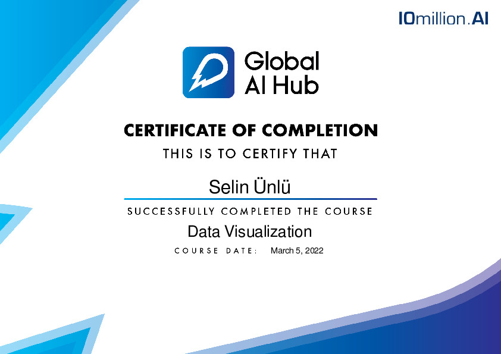

  

# 🎓 Data Visualization Course by [Global AI Hub](https://globalaihub.com/community)

# Syllabus:

### MODÜL  1
- Veri Kavramına Giriş
  - Veri Nedir?
  - Veri Görselleştirme Nedir?
  - Veri Görselleştirmenin Avantajları
  - Veri Türleri

- Kurulum ve Veri Setleri
  - Kütüphaneler
  - Veri Setleri

- Görselleştirme Tipleri
  - Line Plot
  - Scatter Plot
  - Bar Plot
  - Histogram
  - Pie Chart
  - Heatmap
  - Box Plot

### MODÜL 2
- Baştan Sona Uygulamalı Veri Görselleştirme Projesi

  - Veri Setinin İncelenmesi
  - Keşifsel Veri Analizi
  - Veri Önişleme
  - Görselleştirme Tiplerinin Belirlenmesi
  - Rapor Hazırlığı

# Certification
The course completion is certified.

